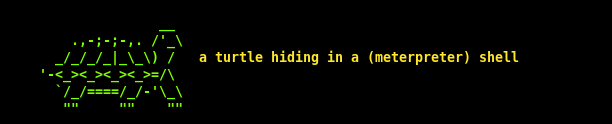

# Turtle



### MSFVenom Powershell Stager Encoder & Generator


#### Usage

```
usage: turtle.py [-h]
                 [--payload {cmd/windows/powershell_bind_tcp,cmd/windows/powershell_reverse_tcp,cmd/windows/reverse_powershell,windows/powershell_bind_tcp,windows/powershell_reverse_tcp}]
                 [--lhost LHOST] [--lport LPORT] [-o O] [-rc RC] [-i I]

generate some obfuscated stagers

optional arguments:
  -h, --help            show this help message and exit
  --payload {cmd/windows/powershell_bind_tcp,cmd/windows/powershell_reverse_tcp,cmd/windows/reverse_powershell,windows/powershell_bind_tcp,windows/powershell_reverse_tcp}
                        msfvenom payload 2 use
  --lhost LHOST         host 4 payload 2 connect back 2
  --lport LPORT         port 4 payload 2 connect back 2
  -o O                  file to save payload 2
  -rc RC                file to save msf resource file 2
  -i I                  amount of encoding iterations
  ```
